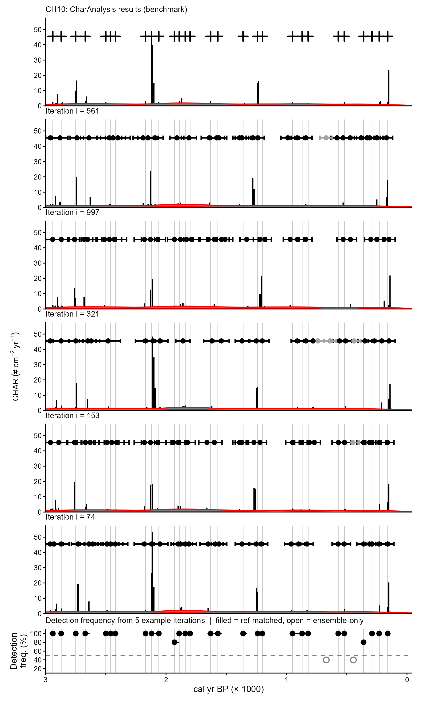
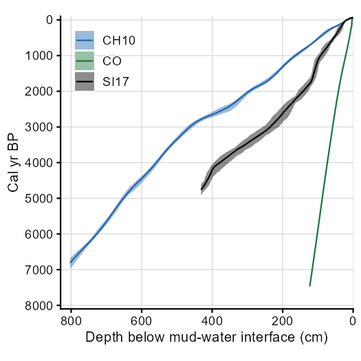
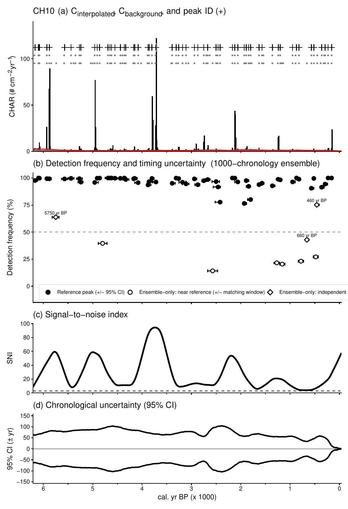
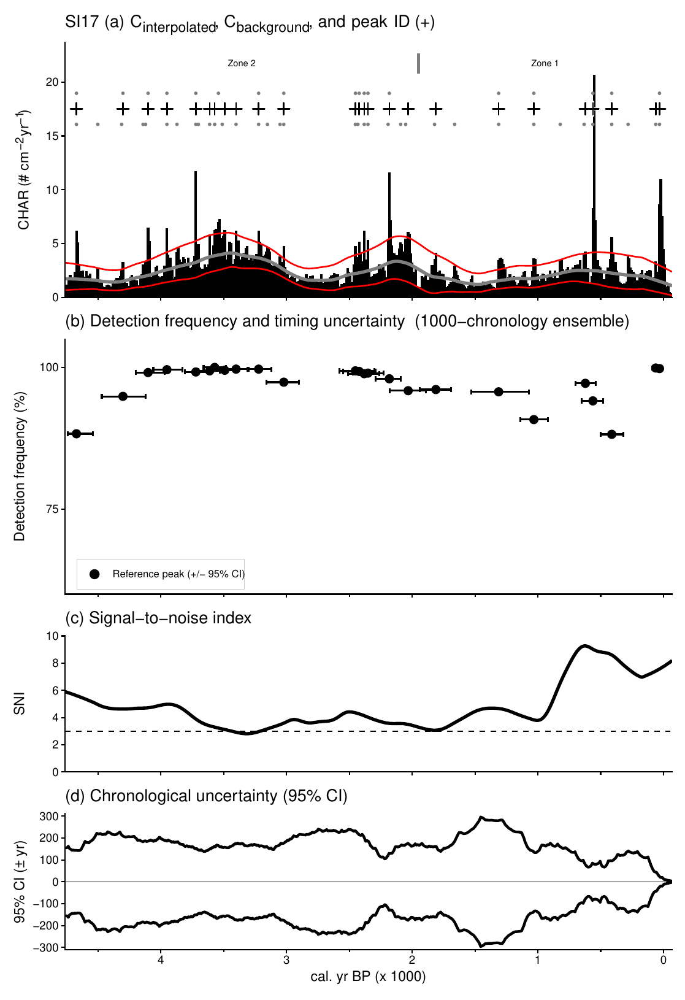
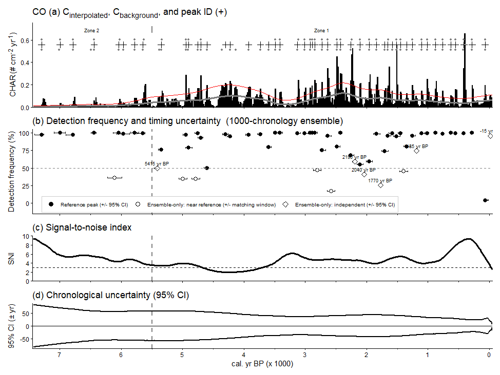

# Integrating Chronological Uncertainty into *CharAnalysis*

*Draft vignette — CharAnalysis 2.0 \| In progress*

------------------------------------------------------------------------

## 1. Motivation and Rationale

Chronological uncertainty inherent in age-depth models affects not just sample age, but also charcoal accumulation rate (CHAR) and thus several elements of threshold determination and peak identification executed in *CharAnalysis*. A single run of *CharAnalysis* does not propagate uncertainty from the underlying age-depth model.

Bayesian age-depth models (e.g., rbacon, Blaauw & Christen 2011; MCAgeDepth, Higuera et al. 2009) estimate the posterior distribution of plausible chronologies via MCMC sampling, producing hundreds to thousands of complete age-depth relationships that reflect uncertainty in the underlying age constraints (calibrated ¹⁴C dates, ²¹⁰Pb age estimates, tephra horizons, etc.). This tool runs *CharAnalysis* across 1,000 chronologies drawn from that posterior, generating an ensemble of results that propagates chronological uncertainty through all steps of the analysis.

The output addresses three questions: (i) how consistently is a peak identified across the ensemble; (ii) what is the range of ages assigned to an individual peak across the ensemble; and (iii) are there peaks commonly identified in the ensemble that are not identified in the main *CharAnalysis* run?

This tool is most valuable when questions center on the identification and timing of individual peaks. Fire-regime statistics (e.g., mean fire-return interval, century-scale fire frequency) are less sensitive to per-peak chronological uncertainty, because errors in adjacent peak ages tend to covary — they share the same underlying age-depth model — and largely cancel when computing age differences. For those statistics, the main *CharAnalysis* run based on the median age-depth model represents the most plausible outcome.

------------------------------------------------------------------------

## 2. Workflow

The ensemble workflow has four steps. Steps 2–4 are implemented in *CharAnalysis*; Step 1 requires an external age-depth modeling tool.

### Step 1: Build an age-depth model and extract a chronology ensemble

Run an age-depth model (e.g., rbacon, MCAgeDepth) and extract *n* = 1,000 chronologies from the MCMC runs. Each chronology is a complete age-depth model at all sampled depths, preserving the temporal correlation structure of the model and reflecting the uncertainty of the dates (e.g., ¹⁴C, ²¹⁰Pb) informing it.

The *CharAnalysis* function `char_extract_bacon_chronologies()` automates extraction from a completed rbacon run:

``` r
library(rbacon)

# Run Bacon in the same R session
Bacon("MySite",
      coredir      = "~/Bacon_runs/",
      acc.mean     = 10,
      acc.shape    = 1,
      mem.mean     = 0.5,
      mem.strength = 10,
      thick        = 5,
      ssize        = 8000,
      ask          = FALSE)

# Extract 1000 chronologies at charData depths
chardata <- read.csv("MySite_charData.csv", check.names = FALSE)

chron <- char_extract_bacon_chronologies(
  depths   = chardata$cmTop,
  n_iter   = 1000,
  out_file = "MySite_1000_chronologies.csv"
)
```

The output CSV has columns `Sample_cm`, `CalAge_1`, ..., `CalAge_1000`. Any age-depth tool can supply this file (e.g. rbacon, MCAgeDepth) as long as the column structure matches.

### Step 2: Run the *CharAnalysis* ensemble

`char_run_ensemble.R` reads the chronology ensemble and site parameter file, and then it runs the full *CharAnalysis* pipeline once per chronology. On each iteration, sample ages are reassigned from chronology *k*, charcoal accumulation rates (CHAR) are recalculated using the updated age-depth relationship, and the resulting CHAR series is processed through background estimation, threshold determination, and peak identification. Output is a peaks matrix (*n* time steps × 1,000 iterations) plus matrices for C~peak~ and C~background~. With parallel processing, 1,000 iterations complete in approximately 2 minutes on a modern laptop.

``` r
# Edit params_file and chron_file at the top of char_run_ensemble.R,
# then source:
source("CharAnalysis_2_0_R/tests/char_run_ensemble.R")
```

### Step 3: Analyze ensemble results

`run_ensemble_analysis.R` characterizes each fire event identified in the benchmark *CharAnalysis* run, the run based on the most plausible (median) age-depth model. For each benchmark peak, the script uses an adaptive matching window to search all 1,000 ensemble iterations for the nearest detected peak, scaled to local chronological uncertainty and mean fire-return interval.

**Adaptive matching window.** The adaptive matching window defines how far — in either direction — an ensemble detection can be from the benchmark peak age and still be attributed to the same fire event. Any detection within ±window~k~ of the benchmark peak age is considered a match:

> window~k~ = max(mFRI~z~ / 2, CI~95,k~ / 2)

where mFRI~z~ is the mean fire-return interval for the zone containing peak *k* (from the benchmark run) and CI~95,k~ is the 95% width of the age-depth model uncertainty at the age of peak *k*, interpolated from the chronology ensemble. The mFRI~z~/2 floor reflects the expectation that once a peak shifts more than half the mean FRI, it is likely a different event. The CI~95,k~/2 term expands the window where age-depth uncertainty is high, ensuring that ensemble detection of the same peak — shifted in time by a poorly constrained chronology — are still correctly attributed to the benchmark peak. In practice, CI~95,k~/2 is the larger of the two terms in records with meaningful age uncertainty; mFRI~z~/2 serves as a minimum bound in well-constrained records where CI~95,k~ is small. The window for each benchmark peak is reported in the output table.

**Ensemble results.** The script reports the following for each benchmark peak:

- **Detection frequency**: fraction of iterations detecting a peak near the benchmark peak age
- **95% CI on peak age**: 2.5th–97.5th percentile of detected ages across iterations
- **Ensemble-only peaks**: events detected in ≥10% of iterations but absent from the benchmark run, flagged as candidate fire events that the median chronology may have missed; the 10% threshold is a user-adjustable parameter, and whether flagged peaks warrant interpretation depends on their detection frequency and temporal coherence across the ensemble

Results are saved to `{site}_peakAgeUncertainty.csv`, one row per peak (reference and ensemble-only). Key columns:

| Column | Description |
|:-----------------------------------|:-----------------------------------|
| `age Top_i (yr BP)` | Benchmark peak age |
| `type` | `reference` or `ensemble_only` |
| `proximity` | For ensemble-only peaks: `near_reference` or `independent`; `NA` for reference |
| `match halfwin (yr)` | Adaptive matching window half-width (window~k~) |
| `n ensemble (iterations)` | Total ensemble iterations (default 1,000) |
| `detection freq (%)` | Percentage of iterations detecting a peak |
| `n detected (peaks)` | Count of iterations with a detection |
| `mean age / median age (yr BP)` | Central tendency of detected ages |
| `sd age (yr)` | Standard deviation of detected ages (1 SD) |
| `CI80 lo / hi (yr BP)` | 10th–90th percentile of detected ages |
| `CI95 lo / hi (yr BP)` | 2.5th–97.5th percentile of detected ages |

**Methods illustration.** `plot_chronUncertainty_methods.R` produces the methods illustration figure described below (Figure 1).

 **Figure 1.** Methods illustration for the chronological uncertainty ensemble, shown for the most recent 3,000 years of the CH10 record (full record spans \~6,200 cal yr BP). *Row 1 (benchmark run):* CHAR time series (black bars), background estimate (grey line), detection thresholds (red lines), and benchmark peak detections ("+"). *Rows 2–6 (five ensemble iterations):* the same CHAR content recalculated under five randomly drawn chronologies. Detected peaks are shown as filled circles with horizontal bars spanning the adaptive matching window (±window~k~): black circles are matched to a benchmark peak; grey circles are unmatched. Vertical grey lines mark benchmark peak ages for reference. *Bottom panel:* detection frequency (%) for each benchmark peak and ensemble-only peak clusters (grey open circles) identified in ≥40% of the five iterations; horizontal bars show the 95% CI on timing where estimable.

### Step 4: Visualize ensemble results

`plot_ensemble_figure.R` produces a four-panel figure (examples below):

- **(a)** CHAR time series with background and peak detections from the benchmark run
- **(b)** Detection frequency (%) for each peak type (reference, near-reference orphan, independent orphan), with 95% CI bars on timing
- **(c)** SNI (signal-to-noise index) trace
- **(d)** Age-depth model 95% CI ribbon from the chronology ensemble

------------------------------------------------------------------------

## 3. Site examples

Three sites illustrate how chronological precision shapes ensemble behavior across a range of record characteristics. CH10 and CO are both unusually well-dated, with closely spaced dates producing narrow, uniform uncertainty throughout — they represent the high-precision end of the spectrum. SI17 is less precisely dated, with wider and more variable uncertainty driven by date spacing, though it remains a well-dated record by typical standards. Together these examples span the range of precision most common in lake-sediment fire history studies.



**Figure 2.** Age-depth models for CH10 (blue), CO (green), and SI17 (black), each derived from the 1,000-chronology ensemble. Lines show the median chronology; shaded ribbons show the 95% CI. Ribbon width reflects chronological precision: narrow and relatively uniform in both CH10 and CO, where closely spaced ²¹⁰Pb and radiocarbon dates constrain the models throughout; wider and more variable in SI17.

|                 Parameter                 |   CH10    |   SI17    |    CO    |
|:-----------------------------------------:|:---------:|:---------:|:--------:|
|         Record length (cal yr BP)         |  \~6,200  |  \~4,700  | \~7,500  |
|      ^14^C, ^210^Pb, and other dates      | 25, 13, 0 | 15, 14, 3 | 7, 3, 0  |
|           Benchmark peaks (*n*)           |    59     |    25     |    50    |
|               Mean FRI (yr)               |    104    |    193    |   148    |
|       Matching window (median ± yr)       |    ±72    |   ±162    |   ±64    |
|      Detection frequency (median %)       |    99     |    99     |    98    |
| Peak timing uncertainty (median 1 SD, yr) |    23     |    53     |    21    |
|       Ensemble-only peaks detected        |  Yes (9)  |    No     | Yes (12) |

### 3.1 CH10 (unusually well-dated; one zone)

CH10 is a lake-sediment record from a Rocky Mountain subalpine watershed spanning \~6,200 cal yr BP, with an age-depth model built from ²¹⁰Pb activity in 13 samples from the upper 20 cm, and 25 radiocarbon dates (Dunnette et al. 2014, Leys et al. 2016). Chronological uncertainty is low and nearly uniform across the record.

The benchmark run identifies 59 peaks (mean FRI 104 yr). Matching windows are narrow (median ±72 yr), driven by the mFRI floor rather than chronological uncertainty. Detection frequencies are high (median 99%; 56 of 59 peaks detected in ≥90% of iterations) and peak timing uncertainty is small (median 1 SD = 23 yr). The ensemble surfaces 9 additional candidate fire events absent from the benchmark run (6 near-reference, 3 independent). CH10 represents the best case: low uncertainty, high detection consistency, and interpretable ensemble-only candidates.

``` r
source("CharAnalysis_2_0_R/tests/run_ensemble_analysis.R")
```

```         
============================================================
  CHRONOLOGICAL UNCERTAINTY SUMMARY
============================================================
  Site         : CH10
  Ensemble     : 1000 iterations  |  -60 - 6800 cal yr BP
  Reference run: 59 peaks  |  160 - 6170 cal yr BP

(a) Detection frequency (% of 1000 iterations):
      Median: 98.6%  |  range: 76.5 - 100.0%  (N = 59 peaks)
      >= 90%: 56 peaks  |  >= 75%: 59 peaks  |  >= 50%: 59 peaks
    Matching window (+/- yr around each reference peak age):
      Median: +/- 72 yr  |  range: +/- 52 to +/- 103 yr

(b) Reference peak timing uncertainty (1 SD, chronological uncertainty only)
      Median SD : 23 yr  |  range: 8 - 40 yr  (N = 59 peaks)

(c) Peaks detected per ensemble iteration:
      Reference run: 59 peaks
      Ensemble -- median: 62  |  range: 50 - 72  (N = 1000 iterations)

(d) Mean FRI (chronological uncertainty | reference-run arithmetic mean)
    Whole record | ref mean FRI: 104 yr | ensemble: min 85  median 98  max 123 yr  (n_iter = 1000)

(e) Ensemble-only peaks (>= 10% detection threshold): 9 total
    Near-reference: 6  |  median ages (cal yr BP): 4800, 2570, 1270, 1160, 780, 480
    Independent: 3  |  ages (cal yr BP): 5750, 660, 460
============================================================
```

 **Figure 3.** Chronological uncertainty ensemble results for CH10. (a) CHAR time series with background and benchmark peak detections. (b) Detection frequency and timing uncertainty for each peak type; horizontal bars show ±95% CI on peak age. (c) Signal-to-noise index. (d) Chronological uncertainty ribbon (95% CI across the 1,000-chronology ensemble).

### 3.2 SI17 (less precisely dated; two zones)

SI17 (Silver Lake, Colorado) spans \~4,700 cal yr BP, with an age-depth model built from ²¹⁰Pb activity in 15 samples spanning the upper 40 cm of sediment, 14 radiocarbon dates, and three estimated ages from tephra layers (Clark-Wolf et al. 2023). Chronological uncertainty is higher than CH10.

The benchmark run identifies 25 peaks (mean FRI 193 yr). Matching windows are wide and variable (±105–280 yr, median ±162 yr), dominated by the CI~95~/2 term. Detection frequencies remain high (median 99%), confirming that fire events are robustly identified even when timing is less precise (median 1 SD = 53 yr). No ensemble-only peaks pass the coherence filter: wide matching windows absorb secondary detections as scatter rather than coherent signal. Ensemble iterations detect more peaks on average (median 32) than the benchmark run (25), a direct consequence of chronological uncertainty affecting CHAR magnitude and threshold determination, not just peak timing.

``` r
source("CharAnalysis_2_0_R/tests/run_ensemble_analysis.R")
```

```         
============================================================
  CHRONOLOGICAL UNCERTAINTY SUMMARY
============================================================
  Site         : SI17
  Ensemble     : 1000 iterations  |  -70 - 4760 cal yr BP
  Reference run: 25 peaks  |  32 - 4672 cal yr BP

(a) Detection frequency (% of 1000 iterations):
      Median: 99.1%  |  range: 88.3 - 100.0%  (N = 25 peaks)
      >= 90%: 24 peaks  |  >= 75%: 25 peaks  |  >= 50%: 25 peaks
    Matching window (+/- yr around each reference peak age):
      Median: +/- 162 yr  |  range: +/- 127 to +/- 280 yr

(b) Reference peak timing uncertainty (1 SD, chronological uncertainty only)
      Median SD : 53 yr  |  range: 18 - 123 yr  (N = 25 peaks)
      By zone:
        Zone 1: median 49 yr | range 18 - 123 yr | n = 8
        Zone 2: median 53 yr | range 42 - 92 yr | n = 17

(c) Peaks detected per ensemble iteration:
      Reference run: 25 peaks
      Ensemble -- median: 32  |  range: 22 - 42  (N = 1000 iterations)

(d) Mean FRI (chronological uncertainty | reference-run arithmetic mean)
    Whole record | ref mean FRI: 193 yr | ensemble: min 106  median 149  max 223 yr  (n_iter = 1000)
    Zone 1       | ref mean FRI: 254 yr | ensemble: min 106  median 174  max 442 yr  (n_iter = 1000)
    Zone 2       | ref mean FRI: 165 yr | ensemble: min 87   median 132  max 234 yr  (n_iter = 1000)

(e) Ensemble-only peaks (>= 10% detection threshold): 0 total
    Near-reference: 0  (no reference window had a secondary cluster in >= 10% of iterations)
    Independent: 0  (no clusters outside reference windows exceeded 10% detection threshold)
============================================================
```

 **Figure 4.** Chronological uncertainty ensemble results for SI17 (Silver Lake). See Figure 3 caption.

### 3.3 CO (moderately well-dated; two zones)

CO (Code Lake) is a lake-sediment record from the south-central Brooks Range, Alaska, spanning \~7,500 cal yr BP, with an age-depth model built from ²¹⁰Pb activity in four samples spanning the upper 2.5 cm of sediment, and seven radiocarbon dates (Higuera et al. 2009). It is the founding dataset for *CharAnalysis* and the primary validation record for the R package. Chronological precision is high throughout — broadly comparable to CH10 — with a modest increase in uncertainty in the oldest portion of the record (\>5,500 cal yr BP).

The benchmark run identifies 50 peaks (arithmetic mean FRI 148 yr). Matching windows are narrow (median ±64 yr), driven by the mFRI floor rather than chronological uncertainty, as in CH10. Detection frequencies are high (median 98%; 38 of 50 peaks detected in ≥90% of iterations), and peak timing uncertainty is small (median 1 SD = 21 yr) — comparable to the resampling interval and a small fraction of the mean FRI.

One reference peak (69 cal yr BP) has low detection frequency (4%), and there is an ensemble-only: independent" peak at -15 yr BP. These are odd. *NOT SURE WHAT THIS REFLECTS AT THIS POINT.*

Matching windows expand from ±64 yr for most of the record to ±118 yr in the oldest zone (\>5,600 cal yr BP), driven by larger chronological uncertainty at depth. Even at their widest, these windows are substantially narrower than those in SI17, confirming that CO occupies the high-precision end of the spectrum alongside CH10.

``` r
source("CharAnalysis_2_0_R/tests/run_ensemble_analysis.R")
```

```         
============================================================
  CHRONOLOGICAL UNCERTAINTY SUMMARY
============================================================
  Site         : CO
  Ensemble     : 1000 iterations  |  -51 - 7500 cal yr BP
  Reference run: 50 peaks  |  69 - 7299 cal yr BP

(a) Detection frequency (% of 1000 iterations):
      Median: 98.4%  |  range: 4.0 - 100.0%  (N = 50 peaks)
      >= 90%: 38 peaks  |  >= 75%: 44 peaks  |  >= 50%: 49 peaks
    Matching window (+/- yr around each reference peak age):
      Median: +/- 64 yr  |  range: +/- 64 to +/- 118 yr
      Note: window = max(mFRI_z / 2, yrInterp, ci95_width / 2) per zone; wide windows
            may absorb potential ensemble-only peaks near reference peaks.

(b) Reference peak timing uncertainty (1 SD, chronological uncertainty only)
      Median SD : 21 yr  |  range: 4 - 60 yr  (N = 50 peaks)

(e) Ensemble-only peaks (>= 10% detection threshold): 12 total
    Near-reference: 6  |  median ages (cal yr BP): 6105, 4995, 4785, 2805, 2580, 1395
    Independent: 6  |  ages (cal yr BP): 5415, 2190, 2040, 1770, 1185, -15
============================================================
```

 **Figure 5.** Chronological uncertainty ensemble results for Code Lake (CO). (a) CHAR time series with background and benchmark peak detections. (b) Detection frequency and timing uncertainty for each peak type; horizontal bars show ±95% CI on peak age. (c) Signal-to-noise index. (d) Chronological uncertainty ribbon (95% CI across the 1,000-chronology ensemble). The very recent ensemble-only peak (−15 cal yr BP) is visible at the left edge of panel (b) with high detection frequency.

------------------------------------------------------------------------

### References

Blaauw, M., and J. A. Christen. 2011. Flexible paleoclimate age-depth models using an autoregressive gamma process. *Bayesian Analysis* 6:457–474.

Higuera, P. E., L. B. Brubaker, P. M. Anderson, F. S. Hu, and T. A. Brown. 2009. Vegetation mediated the impacts of postglacial climate change on fire regimes in the south-central Brooks Range, Alaska. *Ecological Monographs* 79:201–219.

Clark-Wolf, K. D., P. E. Higuera, K. K. McLauchlan, B. N. Shuman, and M. C. Parish. 2023. Fire-regime variability and ecosystem resilience over four millennia in a Rocky Mountain subalpine watershed. *Journal of Ecology* 111:2643–2661.

Dunnette, P. V., P. E. Higuera, K. K. McLauchlan, K. M. Derr, C. E. Briles, and M. H. Keefe. 2014. Biogeochemical impacts of wildfires over four millennia in a Rocky Mountain subalpine watershed. *New Phytologist* 203:900–912.

Leys, B., P. E. Higuera, K. K. McLauchlan, and P. V. Dunnette. 2016. Wildfires and geochemical change in a subalpine forest over the past six millennia. *Environmental Research Letters* 11:125003.
