# *CharAnalysis* User's Guide

**Diagnostic and Analytical Tools for Peak Analysis in Sediment-Charcoal Records**

[](https://creativecommons.org/licenses/by/4.0/) © 2004–2026\
Philip Higuera\
Professor, Department of Ecosystem and Conservation Sciences\
University of Montana, Missoula, MT, USA\
philip.higuera@umontana.edu\
https://www.umt.edu/people/phiguera \
https://github.com/phiguera/CharAnalysis

> **Version 2.0 — Updated March 2026**\
> This guide documents *CharAnalysis* Version 2.0. Where behavior differs
> from Version 1.1, differences are noted explicitly.
> The analytical methods are unchanged between versions.

---

## Contents

- [Part I. Background](#part-i-background)
  - [Citation](#citation)
  - [Support and Updates](#support-and-updates)
- [Part II. Using CharAnalysis](#part-ii-using-charanalysis)
  - [1. Download and Installation](#1-download-and-installation)
  - [2. Data Input and Parameter Selection](#2-data-input-and-parameter-selection)
  - [3. Running CharAnalysis](#3-running-charanalysis)
- [Part III. Understanding CharAnalysis](#part-iii-understanding-charanalysis)
  - [4. Terminology](#4-terminology)
  - [5. General Steps of the Analysis](#5-general-steps-of-the-analysis)
  - [6. Analytical Choices](#6-analytical-choices)
  - [7. CharAnalysis Output](#7-charanalysis-output)
- [Part IV. Acknowledgments](#part-iv-acknowledgments)
- [Part V. Disclaimer](#part-v-disclaimer)
- [Part VI. References](#part-vi-references)

---

## Part I. Background

*CharAnalysis* is a set of diagnostic and analytical tools designed for analyzing sediment-charcoal records when the goal is peak detection to reconstruct "local" fire history. The analyses were developed based on widely applied approaches that decompose a charcoal record into low- and high-frequency components (e.g. Clark and Royall 1996; Long et al. 1998; Carcaillet et al. 2001; Gavin et al. 2006), and the program introduced a technique of using a locally-defined threshold to separate signal from noise (Higuera et al. 2008; 2009). The program is set up to make explicit the range of choices an analyst must make when implementing this approach. Diagnostic tools help determine if peak detection is warranted and, if so, what parameters are most reasonable. Sensitivity analyses illustrate the impacts of alternative analysis criteria on peak-based fire-history interpretations, and graphical displays and statistical analyses summarize peak-based fire-history metrics.

*CharAnalysis* is freely available at https://github.com/phiguera/CharAnalysis. Since its original development in the mid-2000s, the program has been used in dozens of published studies to analyze sediment-charcoal records worldwide. The entire codebase is distributed and well commented — users are encouraged to look under the hood, understand what is going on, and modify the program to suit individual needs. 

### Citation

If you use *CharAnalysis* in a publication, please cite Higuera et al. (2009),
the first study to apply the core analytical tools implemented in *CharAnalysis*:

Higuera, P.E., L.B. Brubaker, P.M. Anderson, F.S. Hu, and T.A. Brown. 2009.
Vegetation mediated the impacts of postglacial climate change on fire regimes
in the south-central Brooks Range, Alaska. *Ecological Monographs* 79:201–219.
https://esajournals.onlinelibrary.wiley.com/doi/full/10.1890/07-2019.1

If you used Version 2.0 specifically, please also cite the software:

Higuera, P.E. 2026. *CharAnalysis*: Diagnostic and analytical tools for peak
analysis in sediment-charcoal records (Version 2.0). Zenodo.
https://doi.org/10.5281/zenodo.19304064

### Support and Updates

Updates are documented on the GitHub repository. If you encounter problems, please use the Issues tab at https://github.com/phiguera/CharAnalysis/issues. A GitHub account is required to register a new issue. Before posting, search existing issues to see whether your problem has already been addressed.

**Version 2.0** (March 2026) is the first major update to the codebase. The analytical methods are unchanged from Version 1.1. Key changes include:

- No toolbox dependencies — all calls to the Curve Fitting Toolbox `smooth()` function have been replaced with a base-MATLAB implementation (`charLowess.m`), so *CharAnalysis* runs on any MATLAB R2019a+ installation without additional licenses.
- Deprecated functions replaced (`plotyy`, `xlsread`, `xlswrite`, `hist`, and others).
- Global variables eliminated, improving reliability when functions are called in non-standard order.
- Computation separated from visualization, making batch processing more straightforward.
- Input validation added, providing clear error messages for common misconfigurations.
- Several bugs corrected (see the repository README for details).

---

## Part II. Using CharAnalysis

### 1. Download and Installation

There are three ways to access *CharAnalysis*, suited to different users and needs.

---

#### Option 1: Download and Run Locally in MATLAB *(recommended)*

This is the recommended option for researchers conducting analyses on their own data.

**Requirements**
- MATLAB R2019a or higher. No additional toolboxes are required.

> **V1.1 difference:** Version 1.1 requires MATLAB 7.0 or higher and the
> Curve Fitting Toolbox. Version 2.0 has no toolbox dependencies.

**Download**

Download the entire *CharAnalysis* program as a `.zip` or `tar.gz` archive from the project website at https://phiguera.github.io/CharAnalysis/, or clone the repository directly:

```
https://github.com/phiguera/CharAnalysis
```

Cloning or downloading retrieves the entire repository, including example datasets and the version comparison script. The Version 2.0 MATLAB code is located in the `CharAnalysis_2_0_MATLAB` subfolder.

**Installation**

1. After cloning or downloading, add the `CharAnalysis_2_0_MATLAB` folder to your MATLAB search path:
   ```matlab
   addpath '.../CharAnalysis_2_0_MATLAB'
   ```
2. Save the path:
   ```matlab
   savepath
   ```
3. You are now ready to use *CharAnalysis*.

> **Note:** Prior to April 2014, *CharAnalysis* was hosted on Google Code
> (http://code.google.com/p/charanalysis/). Resolved issues from that
> period are archived there.

---

#### Option 2: Standalone Windows Application (Version 1.1)

A standalone Windows executable (`.exe`) is available for users without a MATLAB license. This version is based on **Version 1.1** and predates the Version 2.0 update. Download and installation instructions are available at:

https://github.com/phiguera/CharAnalysis/blob/master/CharAnalysis_1_1_Windows/readme_CharAnalysis_standAlone.md

> **Important:** The standalone application requires the MATLAB Component
> Runtime (MCR) to be installed on your computer. The MCR installer is
> included with the download and needs to be run only once per computer.
> On first startup, the program may take up to several minutes to open.

---

#### Option 3: Try It Online via MATLAB Online

Not sure if *CharAnalysis* is the right tool for your research? You can run the program instantly in your web browser on the bundled Code Lake example dataset — no installation required. Click the badge below or visit the GitHub repository page.

[](https://matlab.mathworks.com/open/github/v1?repo=phiguera/CharAnalysis&branch=main&file=CharAnalysis_2_0_MATLAB/CharAnalysis.m)

Clicking this link clones the repository to your MATLAB Drive and opens *CharAnalysis* ready to run. A free MathWorks account is required. University users can log in with their institutional email address for full access.

> **Note:** MATLAB Online is best suited for evaluating *CharAnalysis* on
> the bundled example dataset. For analysis of your own data, Option 1
> (local MATLAB) is recommended — uploading data files and editing
> parameter files is more straightforward in the desktop environment.
> When running online, set `saveData = 0` and `saveFigures = 0` in the
> parameter file to avoid file-write errors.

---

### 2. Data Input and Parameter Selection

Open the included template file `templateChar.csv` (or `templateChar.xls`) and save it under a new name identifying your site (e.g. `COchar.csv`). Place this file in the MATLAB working directory, or specify the full path when calling *CharAnalysis*.

> **V1.1 difference:** The CSV format is recommended for Version 2.0.
> The original `.xls` template remains supported and has the same
> structure as the CSV file.

#### 2.1 Data Input

Paste charcoal data into the `charData` worksheet (Figure 1). The format is the same as for the program Charster (Gavin). For each sample, enter:

| Column | Variable   | Description |
|--------|------------|-------------|
| 1      | cmTop      | Depth at top of sample (cm) |
| 2      | cmBot      | Depth at base of sample (cm) |
| 3      | ageTop     | Age at top of sample (cal. yr BP) |
| 4      | ageBot     | Age at bottom of sample (cal. yr BP) |
| 5      | charVol    | Volume of sediment sample (cm³) |
| 6      | charCount  | Charcoal count (pieces) |

Enter the site name in cell G1 (column 7, row 1).

Missing values for `charVol` and `charCount` (but **not** for depths or ages) can be indicated by any value < 0 (e.g. −999). *CharAnalysis* will interpolate across missing data. Note: paste only values into the spreadsheet — formulas are not supported.

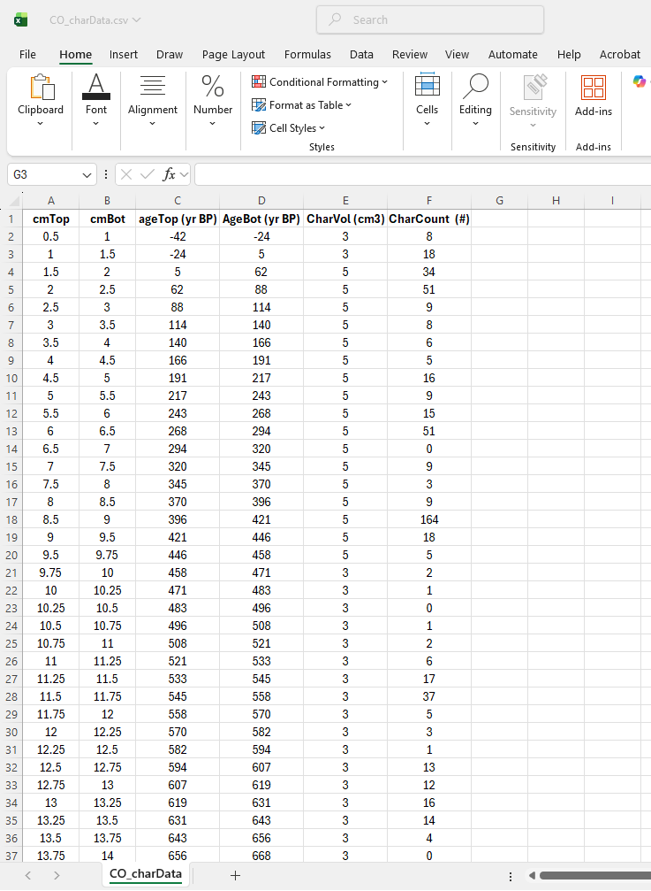 \
*Figure 1. The charData worksheet in the template file, where data input occurs.*

---

#### 2.2 Parameter Selection

Parameter choices are entered in column C (column 3) of the `CharParams` worksheet (Figure 2). Parameters are divided into four stages.

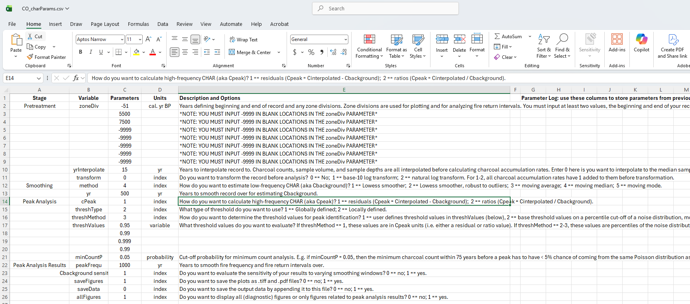
*Figure 2. The CharParams worksheet in the template file, where analysis parameters are selected.*

---

##### Pretreatment

| Parameter  | Description |
|------------|-------------|
| `zoneDiv`  | Years defining the beginning and end of the record, and any zone divisions. Used for plotting and for analyzing fire return intervals. Enter at least two values (beginning and end of record) in ascending order (youngest age first). Additional zone boundaries may be added. |
| `yrInterp` | Interpolation interval (years). All records are resampled to equal time intervals before analysis. Enter `0` to interpolate to the median sample resolution of the raw record. |
| `transform` | Data transformation before analysis: `0` = none; `1` = base-10 log; `2` = natural log. For options 1–2, a value of 1 is added to all CHAR values before transformation. |

---

##### Smoothing

| Parameter | Description |
|-----------|-------------|
| `method`  | Smoothing method for estimating C<sub>background</sub>: `1` = Lowess; `2` = Robust Lowess (resistant to outliers); `3` = Moving average; `4` = Moving median; `5` = Moving mode. |
| `yr`      | Smoothing window width (years) for estimating C<sub>background</sub>. |

---

##### Peak Analysis

| Parameter | Description |
|-----------|-------------|
| `cPeak` | Method for calculating C<sub>peak</sub>: `1` = residuals (C<sub>peak</sub> = C<sub>int</sub> − C<sub>back</sub>); `2` = ratios (C<sub>peak</sub> = C<sub>int</sub> / C<sub>back</sub>). |
| `threshType` | Threshold type: `1` = globally defined (based on entire record); `2` = locally defined (sliding window around each sample). |
| `threshMethod` | Method for determining threshold values: `1` = user-defined values in `threshValues`; `2` = percentile of a Gaussian noise distribution; `3` = same as 2, but noise distribution determined by a Gaussian mixture model. |
| `threshValues` | Threshold values to evaluate (up to 4 values). If `threshMethod = 1`, values are in C<sub>peak</sub> units. If `threshMethod = 2–3`, values are percentiles of the noise distribution (e.g. `0.95`). The last value is used for peak plotting and analysis. |
| `minCountP` | Cut-off probability for minimum-count analysis (e.g. `0.05`). Potential peaks where the preceding minimum count has a probability > `minCountP` of coming from the same Poisson distribution as the peak count are flagged but excluded from analysis. Set to `0.99` to turn off. |
| `peakFrequ` | Smoothing window (years) for fire frequency and fire return interval curves. |
| `sensitivity` | Set to `1` to evaluate sensitivity of results to varying C<sub>background</sub> window widths; `0` to skip. |

---

##### Results

| Parameter | Description |
|-----------|-------------|
| `saveFigures` | Save output figures as `.tiff` and `.pdf` files? `0` = no; `1` = yes. Set to `0` when using MATLAB Online. |
| `saveData` | Append output data to the input file? `0` = no; `1` = yes. Set to `0` when using MATLAB Online. |
| `allFigures` | Display all diagnostic figures (including Figures 1, 2, and 9)? `0` = no (show only peak analysis results); `1` = yes. |

---

### 3. Running CharAnalysis

#### 3.1 From within MATLAB

Open MATLAB and type `CharAnalysis` into the Command Window. When prompted, enter the name of your parameter file with single quotation marks and the file extension:

```matlab
>> CharAnalysis('mysite_charParams.csv')
```

You can also call *CharAnalysis* directly with the filename as an argument, which is useful for processing multiple records:

```matlab
>> CharAnalysis('site1.csv')
>> CharAnalysis('site2.csv')
```

To return results to the MATLAB workspace:

```matlab
>> results = CharAnalysis('mysite_charParams.csv')
```

---

#### 3.2 Causes of Common Errors

| Error | Likely Cause |
|-------|-------------|
| Program quits while interpolating or smoothing | Input file contains formulas rather than plain values; multiple depths have the same age; or smoothing window is longer than the record. |
| `Unable to find file` error when saving results | The output file does not exist in the current directory. Set `saveData = 0` and `saveFigures = 0` to skip saving (required for MATLAB Online). |
| Unexpected peak counts vs. Version 1.1 | Verify parameter settings match between versions. Use `z_Compare_CharAnalysis_V1_V2.m` to compare outputs numerically. |
| Figures appear very large in MATLAB Online | This is a display scaling issue. Drag figure window corners to resize, or use browser zoom (Ctrl/Cmd −) to reduce the interface size. |

---

## Part III. Understanding CharAnalysis

### 4. Terminology

| Term | Description |
|------|-------------|
| C | Charcoal accumulation rate (CHAR; pieces cm⁻² yr⁻¹) |
| C<sub>raw</sub> | CHAR of the raw record |
| C<sub>int</sub> | CHAR of the interpolated record |
| C<sub>back</sub> | Low-frequency trend in C<sub>int</sub>, also termed "background CHAR" or "BCHAR" in the literature |
| C<sub>peak</sub> | High-frequency component of C<sub>int</sub>, after C<sub>back</sub> is removed |
| C<sub>noise</sub> | One of the two additive components of C<sub>peak</sub> |
| C<sub>fire</sub> | The other additive component of C<sub>peak</sub> |
| t | Sample-specific threshold value used to separate C<sub>noise</sub> from C<sub>fire</sub> |
| C<sub>thresh</sub> | Time series of t, displayed in various ways in output figures |
| SNI | Signal-to-noise index: var(C<sub>fire</sub>) / (var(C<sub>fire</sub>) + var(C<sub>noise</sub>)) |

---

### 5. General Steps of the Analysis

The structure of *CharAnalysis* reflects the main analytical components of most decomposition methods. At each step the user makes one or more parameter decisions (Figure 3). The general steps are:

1. **Interpolate** the raw charcoal series (concentration [pieces cm⁻³], sediment accumulation rate [cm yr⁻¹]) to equal time intervals to define C<sub>interpolated</sub> (pieces cm⁻² yr⁻¹).
2. **Smooth** C<sub>int</sub> to model low-frequency trends and define C<sub>back</sub>.
3. **Remove** C<sub>back</sub> from C<sub>int</sub> to create C<sub>peak</sub>, containing only high-frequency variations.
4. **Define threshold** t and apply to C<sub>peak</sub> to separate fire-related samples from non-fire-related samples.
5. **Screen peaks** and remove any that fail to pass the minimum-count criterion.

---

### 6. Analytical Choices

#### 6.1 Pretreatment

**Stratifying Records.** Records can be divided into user-defined zones identified by ages. Zone divisions are used for plotting and for statistical comparisons of fire return intervals.

**Interpolating.** All records must be resampled to equal time intervals to justify the techniques used for peak analysis. Resampling in *CharAnalysis* determines the relative proportion that each raw sample contributes to each interpolated interval, then weights the raw sample(s) within an interpolated interval based on these proportions. This technique preserves the primary structure of the charcoal data better than binning pseudo-annual values derived by linear interpolation, because it makes fewer assumptions about the pattern of charcoal deposition within sampling intervals. The interpolation interval can be user-defined or set to the median sampling interval of all raw samples.

**Data Transformation.** Before peak analysis, CHAR data can be transformed via log (base 10) or natural log transformations. In each case, a value of 1 is added to all CHAR values before transformation.

---

#### 6.2 Smoothing

Smoothing refers to the method used to model low-frequency trends in a charcoal record, C<sub>background</sub>. The analyst must select both a smoothing method and a timescale (window width) that define C<sub>back</sub>. Tools to help make this choice are presented in Figure 10 (C<sub>background</sub> sensitivity analysis). *CharAnalysis* includes five smoothing methods:

1. **Lowess** — locally weighted scatter plot smooth using least squares linear polynomial fitting.
2. **Robust Lowess** — Lowess smoothing resistant to outliers.
3. **Moving average** filter.
4. **Moving median** — each sample is assigned the median value of C<sub>int</sub> within the smoothing window. The resulting series is then smoothed with a Lowess filter.
5. **Moving mode** — each sample is assigned the modal value from C<sub>int</sub> within the smoothing window, with values divided into 100 equally-spaced bins. The resulting series is then smoothed with a Lowess filter.

> **V1.1 difference:** Version 1.1 used the `smooth()` function from the
> MATLAB Curve Fitting Toolbox for methods 1–3. Version 2.0 replaces
> this with a base-MATLAB implementation (`charLowess.m`), so no
> toolbox is required.

---

#### 6.3 Peak Analysis

*CharAnalysis* includes several methods for peak analysis, reflecting both approaches used in the literature and techniques introduced with the program. The approach involves three steps.

##### Step 1: Define C<sub>peak</sub>

Remove low-frequency trends in C<sub>int</sub> to obtain a peak CHAR series, C<sub>peak</sub>. Two options:

- **Residuals:** C<sub>peak</sub> = C<sub>int</sub> − C<sub>back</sub>. Assumes an additive relationship between C<sub>back</sub> and charcoal introduced by local fires.
- **Ratios:** C<sub>peak</sub> = C<sub>int</sub> / C<sub>back</sub>. Assumes a multiplicative relationship.

##### Step 2: Define and Apply a Threshold

Determine and apply a threshold value t to each C<sub>peak</sub> sample, flagging the sample as a "peak" if C<sub>peak</sub> > t. Three options:

**Option 1 — Define t manually.** Threshold values are entered directly in C<sub>peak</sub> units (residual or ratio, depending on the `cPeak` setting).

**Option 2 — Define t based on the C<sub>noise</sub> distribution.** The user selects a percentile cut-off of the noise distribution (e.g. `0.95` places the threshold at the 95th percentile of C<sub>noise</sub>). Two approaches for estimating C<sub>noise</sub>:

- **Gaussian assumption** (`threshMethod = 2`): assumes the mean of C<sub>noise</sub> is 0 (residuals) or 1 (ratios) and estimates variance from the lower tail of the C<sub>peak</sub> distribution.
- **Gaussian mixture model** (`threshMethod = 3`): uses a two-component Gaussian mixture model to identify the mean and variance of C<sub>noise</sub> more accurately when the noise distribution mean is not exactly 0 or 1.

In both cases, t can be defined **globally** (based on the entire C<sub>peak</sub> distribution) or **locally** (based on a sliding window of the same width as the C<sub>back</sub> smoothing window). The locally-defined threshold is described in Higuera et al. (2008; 2009). When using a locally-defined threshold, ensure the window width includes at least 30 samples.

##### Step 3: Minimum-Count Screening

Each sample exceeding the threshold is subjected to minimum-count screening before being classified as a charcoal peak. This test calculates the probability that two charcoal counts could arise from the same Poisson distribution (Shiue and Bain 1982). The minimum charcoal count in the 75 years preceding the potential peak is compared to the maximum count within 75 years following it. The test statistic d is:

$$d = \frac{\left| X_1 - (X_1 + X_2)\frac{V_1}{V_1 + V_2} \right| - 0.5}{\sqrt{(X_1 + X_2)\frac{V_1}{V_1+V_2}\frac{V_2}{V_1+V_2}}}$$

where X<sub>1</sub>, V<sub>1</sub> are the count and volume of the minimum-count sample, and X<sub>2</sub>, V<sub>2</sub> are those of the maximum-count sample. Peaks with a probability greater than `minCountP` are flagged but excluded from peak analysis.

---

### 7. CharAnalysis Output

#### 7.1 Data

Output data are saved to a `CharResults` worksheet (or appended to the input CSV file) when `saveData = 1`. The columns are as follows:

| Column | Variable | Description |
|--------|----------|-------------|
| A | cmTop_i | Interpolated top depth (cm) |
| B | ageTop_i | Interpolated top age (cal. yr BP) |
| C | charCount_i | Interpolated charcoal counts (pieces) |
| D | charVol_i | Interpolated sample volume (cm³) |
| E | charCon_i | Interpolated charcoal concentration (pieces cm⁻³) |
| F | charAcc_i | Interpolated CHAR (pieces cm⁻² yr⁻¹) |
| G | charBkg | C<sub>background</sub> (pieces cm⁻² yr⁻¹) |
| H | charPeak | C<sub>peak</sub> (pieces cm⁻² yr⁻¹) |
| I | thresh1 | 1st threshold value |
| J | thresh2 | 2nd threshold value |
| K | thresh3 | 3rd threshold value |
| L | threshFinalPos | Final positive threshold value |
| M | threshFinalNeg | Final negative threshold value |
| N | SNI | Signal-to-noise index |
| O | threshGOF | KS goodness-of-fit p-value for the noise distribution |
| P | peaks1 | Binary: start of identified peak using thresh1 |
| Q | peaks2 | Same as peaks1, but for thresh2 |
| R | peaks3 | Same as peaks1, but for thresh3 |
| S | peaksFinal | Same as peaks1, but for threshFinalPos |
| T | peaksInsig | Peaks flagged by the minimum-count criterion |
| U | peakMag | Peak magnitude (pieces cm⁻² peak⁻¹) |
| V | smPeakFrequ | Smoothed fire frequency (fires per 1000 yr) |
| W | smFRIs | Smoothed fire return intervals (yr fire⁻¹) |
| X | nFRIs | Total number of FRIs per zone |
| Y | mFRI | Mean FRI per zone (yr) |
| Z | mFRI_uCI | Upper 95% CI for mFRI (1000 bootstrapped samples) |
| AA | mFRI_lCI | Lower 95% CI for mFRI |
| BB | WBLb | Weibull scale parameter b (yr) |
| CC | WBLb_uCI | Upper 95% CI for WBLb |
| DD | WBLb_lCI | Lower 95% CI for WBLb |
| EE | WBLc | Weibull shape parameter c |
| FF | WBLc_uCI | Upper 95% CI for WBLc |
| GG | WBLc_lCI | Lower 95% CI for WBLc |

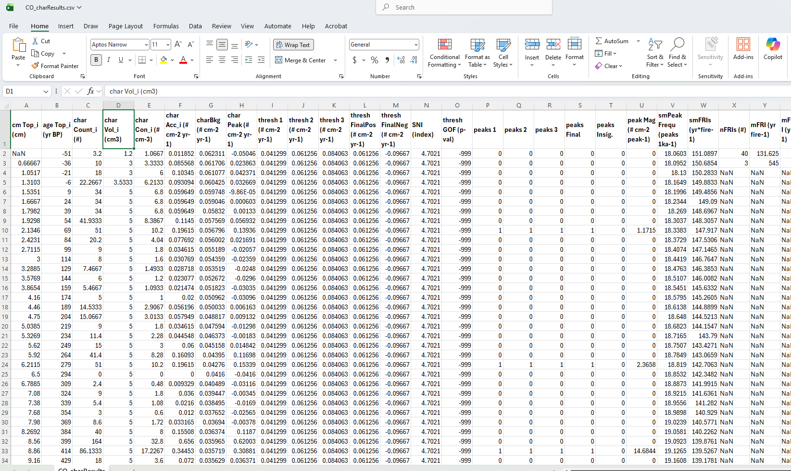
*Figure 3. Example of the CharResults worksheet after running CharAnalysis and saving data.*

---

#### 7.2 Figures

Output figures provide a detailed look at what the program is doing numerically and display publication-quality summaries of charcoal series and peak-analysis results. All time-series plots (except Figure 2) are scaled horizontally based on the amount of time analyzed. Up to 10 figures are produced depending on parameter choices.

---

**Figure 1: C<sub>raw</sub> and C<sub>interpolated</sub>; smoothing options**

Panel (a): raw CHAR displayed as bars with C<sub>interpolated</sub> as a stair-step plot. Panel (b): C<sub>interpolated</sub> with all five smoothing options for a selected window width. Areas with missing values are indicated by grey boxes.

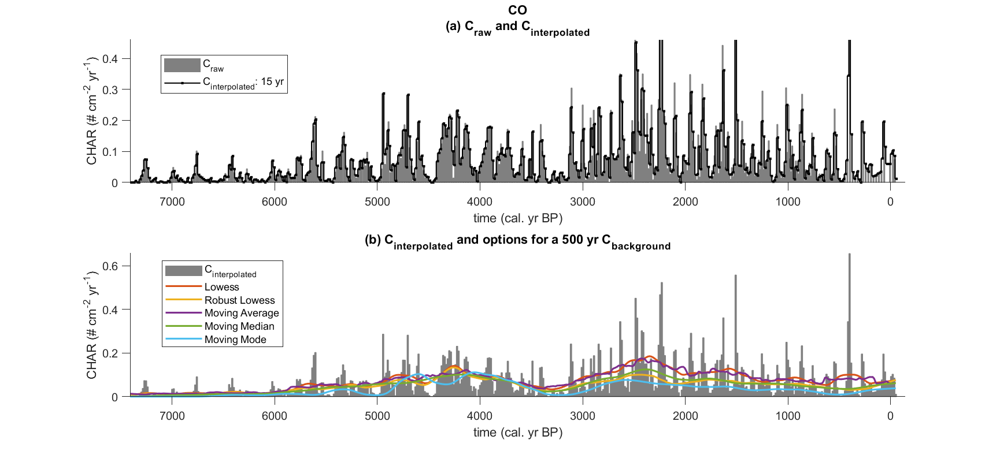

---

**Figure 2: Distribution of C<sub>peak</sub> values**

Varies depending on threshold type. For a global threshold, shows the full C<sub>peak</sub> distribution as a histogram with the modeled noise distribution and threshold value. For a local threshold, shows multiple non-overlapping time periods, each with the modeled noise distribution, local threshold values (t<sub>yr</sub>), SNI, and KS goodness-of-fit (KS p-val).

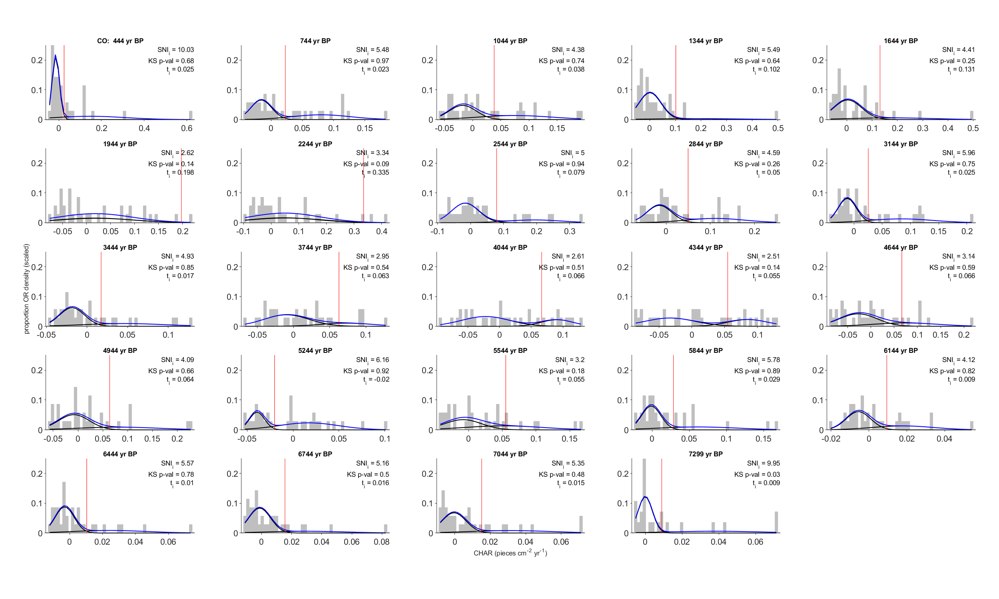

---

**Figure 3: C<sub>int</sub>, C<sub>back</sub>, and C<sub>peak</sub>**

Panel (a): C<sub>int</sub> with C<sub>back</sub> overlaid. Panel (b): C<sub>peak</sub> with positive and negative threshold values defining C<sub>noise</sub>, and identified peaks marked as `+` symbols. Peaks failing the minimum-count criterion are shown as grey dots.

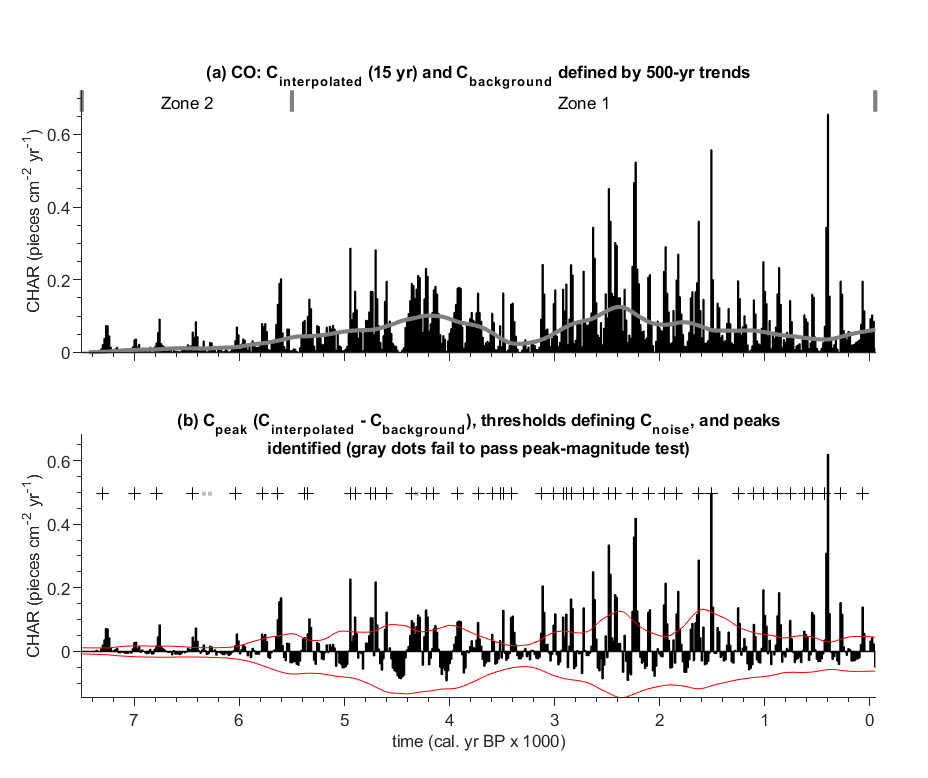

---

**Figure 4: Sensitivity to alternative thresholds and signal quality**

Panel (a): CHAR series with peaks from all three threshold values. Panel (b): mean FRI and 95% confidence limits by zone for each threshold. Panel (c): SNI time series. Panel (d): boxplot of all SNI values. Note: y-axes in panels (b) and (c) are log scales.


---

**Figure 5: Cumulative peaks through time**

Cumulative sum of identified peaks as a function of time. The slope at any point is the instantaneous fire frequency (fires yr⁻¹). Areas with missing values are indicated by grey boxes.

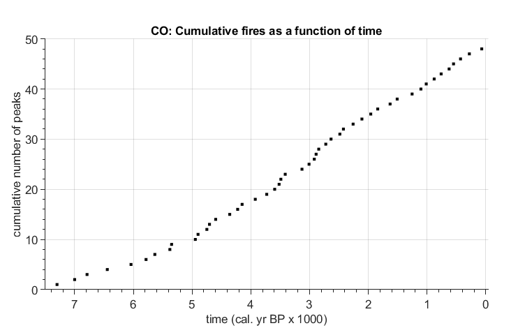

---

**Figure 6: Fire return interval distributions by zone**

Histogram of FRIs within each zone (20-yr bins). If the fitted Weibull model passes the goodness-of-fit test (p > 0.10 if n < 30; p > 0.05 if n ≥ 30), model parameters and 95% confidence estimates are listed along with mFRI, confidence estimates, and n.

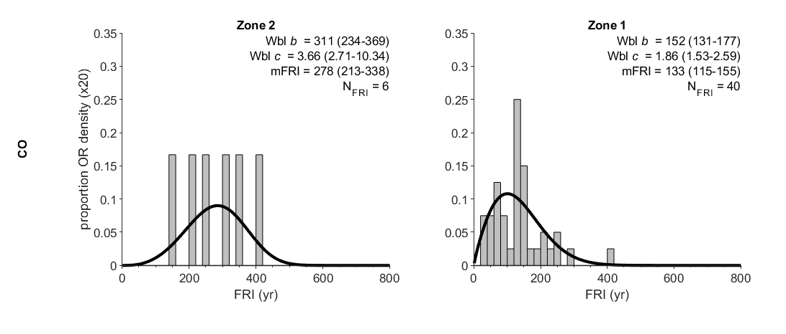

---

**Figure 7: Continuous fire history**

Top panel: peak magnitude as bars with identified peaks as `+` symbols. Middle panel: fire return intervals and smoothed FRI curve. Bottom panel: smoothed fire frequency. In all panels, areas with missing values are indicated by grey boxes.

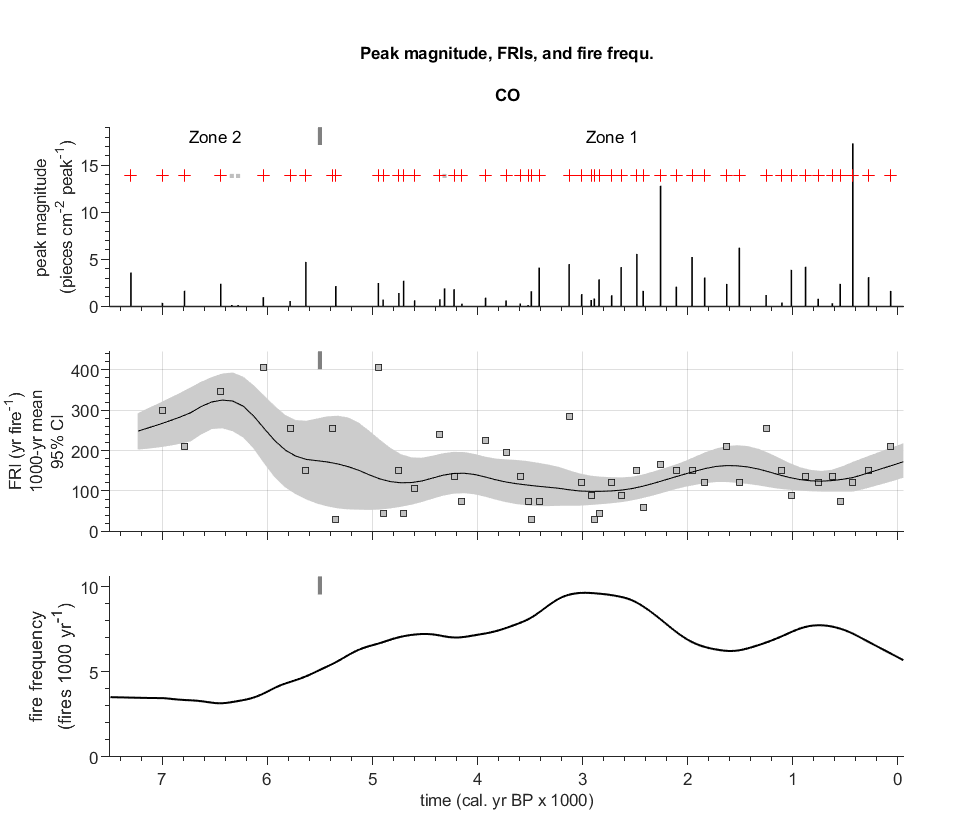

---

**Figure 8: Between-zone comparisons of raw CHAR distributions**

Left panel: cumulative distribution functions (CDFs) of raw CHAR values within each zone. Two-sample KS tests compare zones pairwise; a table of p-values is displayed within the plot. Right panel: box plots of raw CHAR values by zone (10th, 25th, 50th, 75th, and 90th percentiles).

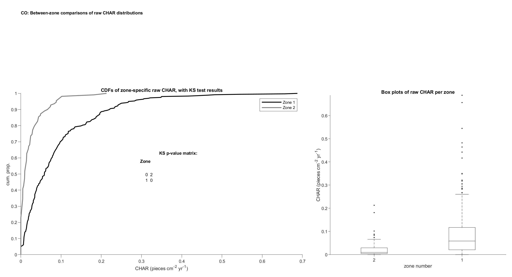

---

**Figure 9: Alternative displays of threshold values**

Panel (a): C<sub>int</sub> with C<sub>back</sub> and C<sub>thresh</sub>. Panel (b): C<sub>peak</sub> and C<sub>thresh</sub> displayed in the ratio domain. Panel (c): C<sub>peak</sub> and C<sub>thresh</sub> displayed in the residual domain. This figure illustrates how the selected threshold would appear under both C<sub>peak</sub> definitions.

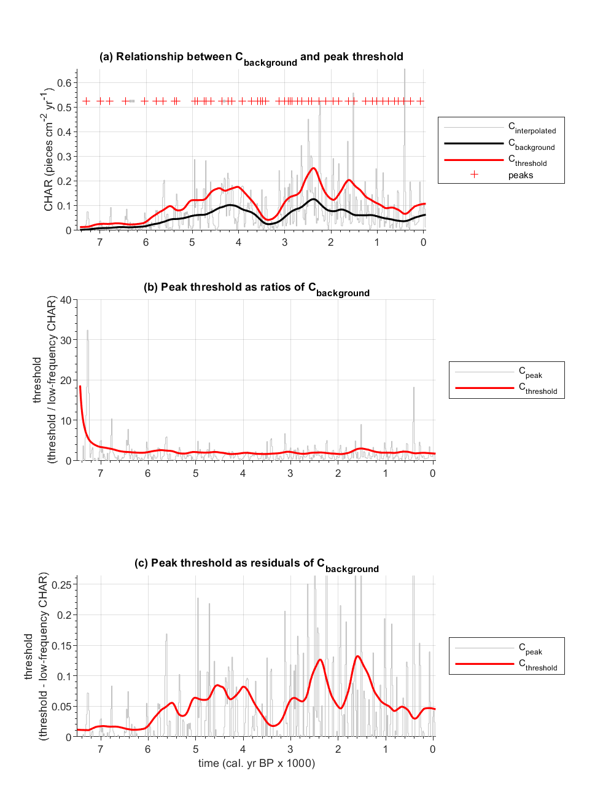

---

**Figure 10: Sensitivity to C<sub>background</sub> window width** *(produced only when sensitivity = 1)*

Results from multiple analyses using varying smoothing window widths. For a local threshold: (a) KS goodness-of-fit p-values by window width; (b) SNI distributions by window width; (c) sum of (a) and (b), useful for selecting the optimal window when the two measures show opposing trends. For a global threshold: a three-variable plot of peak count (z) as a function of threshold value (x) and smoothing window (y).

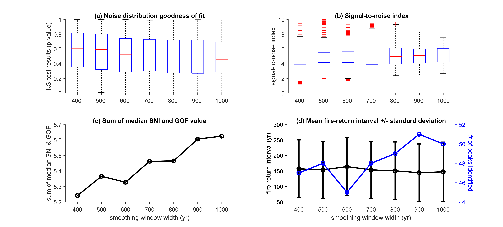

---

## Part IV. Acknowledgments

Many features in *CharAnalysis* are based on analytical techniques from the programs CHAPS (Patrick Bartlein, University of Oregon) and Charster (Daniel Gavin, University of Oregon). The resampling algorithm and minimum-count screening were developed directly from features in Charster. Peak magnitude and smoothed fire frequency displays were developed based on CHAPS. *CharAnalysis*, like Charster, uses a Gaussian mixture model originally created by Charles Bouman (Purdue University).

Development of the program has benefited greatly from discussions with and testing by members of the Whitlock Paleoecology Lab at Montana State University, Dan Gavin, Patrick Bartlein, and Ryan Kelly.

**Version 2.0** was developed with the assistance of Claude, an AI assistant by Anthropic. Claude assisted with code modernization, bug fixes, architecture redesign, and documentation. All code was reviewed and validated by the author against Version 1.1 reference outputs.

*CharAnalysis* was written in MATLAB with resources from the University of Washington, Montana State University, the University of Illinois, the University of Idaho, and the University of Montana. Version 2.0 targets MATLAB R2019a or higher.

---

## Part V. Disclaimer

THIS SOFTWARE PROGRAM AND DOCUMENTATION ARE PROVIDED "AS IS" AND WITHOUT WARRANTIES AS TO PERFORMANCE. THE PROGRAM *CharAnalysis* IS PROVIDED WITHOUT ANY EXPRESSED OR IMPLIED WARRANTIES WHATSOEVER. BECAUSE OF THE DIVERSITY OF CONDITIONS AND HARDWARE UNDER WHICH THE PROGRAM MAY BE USED, NO WARRANTY OF FITNESS FOR A PARTICULAR PURPOSE IS OFFERED. THE USER IS ADVISED TO TEST THE PROGRAM THOROUGHLY BEFORE RELYING ON IT. THE USER MUST ASSUME THE ENTIRE RISK AND RESPONSIBILITY OF USING THIS PROGRAM.

THE USE OF THE SOFTWARE DOWNLOADED FROM THE UNIVERSITY OF MONTANA WEBSITE OR GITHUB IS DONE AT YOUR OWN RISK AND WITH AGREEMENT THAT YOU ARE SOLELY RESPONSIBLE FOR ANY DAMAGE TO YOUR COMPUTER SYSTEM OR LOSS OF DATA THAT RESULTS FROM SUCH ACTIVITIES.

---

## Part VI. References

Briles, C. E., C. Whitlock, P. J. Bartlein, and P. E. Higuera. 2008. Regional and local controls on postglacial vegetation and fire in the Siskiyou Mountains, northern California, USA. *Palaeogeography Palaeoclimatology Palaeoecology* 265:159–169.

Carcaillet, C., Y. Bergeron, P. Richard, B. Frechette, S. Gauthier, and Y. Prairie. 2001. Change of fire frequency in the eastern Canadian boreal forests during the Holocene: does vegetation composition or climate trigger the fire regime? *Journal of Ecology* 89:930–946.

Clark, J. S., and P. D. Royall. 1996. Local and regional sediment charcoal evidence for fire regimes in presettlement north-eastern North America. *Journal of Ecology* 84:365–382.

Clark, J. S., P. D. Royall, and C. Chumbley. 1996. The role of fire during climate change in an eastern deciduous forest at Devil's Bathtub, New York. *Ecology* 77:2148–2166.

Gavin, D. G., F. S. Hu, K. Lertzman, and P. Corbett. 2006. Weak climatic control of stand-scale fire history during the late Holocene. *Ecology* 87:1722–1732.

Higuera, P. E., L. B. Brubaker, P. M. Anderson, T. A. Brown, A. T. Kennedy, and F. S. Hu. 2008. Frequent fires in ancient shrub tundra: implications of paleorecords for Arctic environmental change. *PLoS ONE* 3:e0001744.

Higuera, P. E., L. B. Brubaker, P. M. Anderson, F. S. Hu, and T. A. Brown. 2009. Vegetation mediated the impacts of postglacial climate change on fire regimes in the south-central Brooks Range, Alaska. *Ecological Monographs* 79(2):201–219.

Higuera, P. E., M. E. Peters, L. B. Brubaker, and D. G. Gavin. 2007. Understanding the origin and analysis of sediment-charcoal records with a simulation model. *Quaternary Science Reviews* 26:1790–1809.

Long, C. J., C. Whitlock, P. J. Bartlein, and S. H. Millspaugh. 1998. A 9000 year fire history from the Oregon Coast Range based on a high-resolution charcoal study. *Canadian Journal of Forest Research* 28:774–787.

Shiue, W., and L. Bain. 1982. Experiment size and power comparisons for two-sample Poisson tests. *Applied Statistics* 31:130–134.
