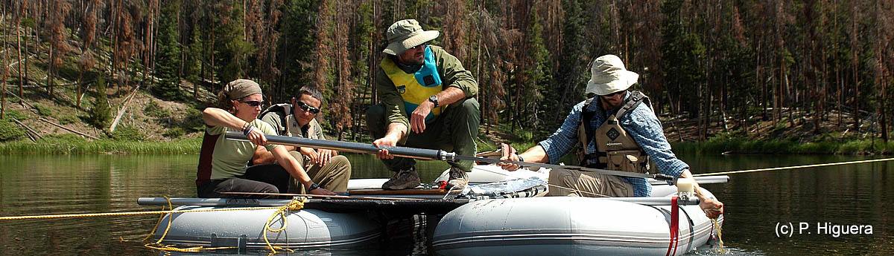
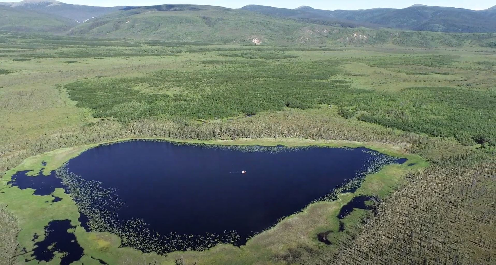
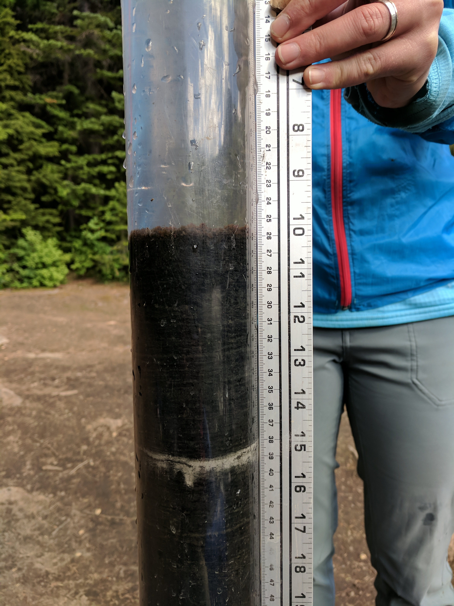
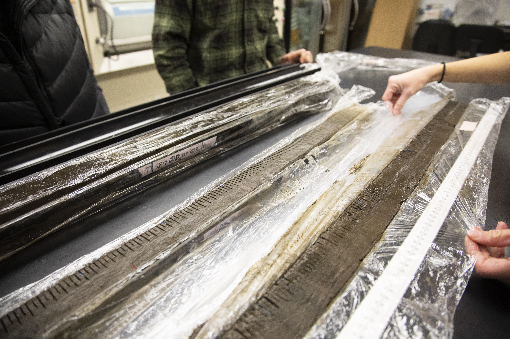
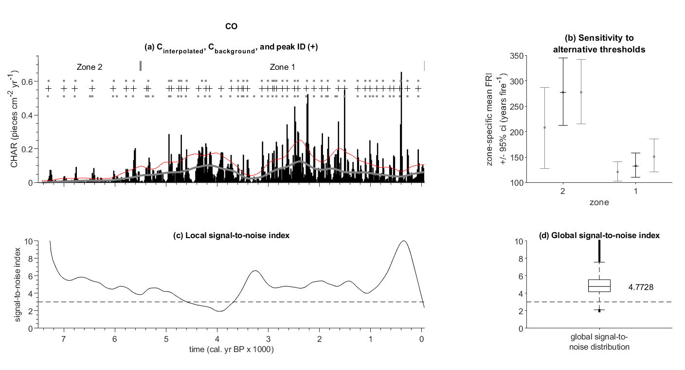

# *CharAnalysis*
## Diagnostic and analytical tools for peak detection in sediment-charcoal records

*Collecting a sediment core from Chickaree Lake, Rocky Mountain National Park, Colorado. Photo: G. Carter (2010).*

© 2004–2026\
Philip Higuera  
Professor, Department of Ecosystem and Conservation Sciences  
University of Montana, Missoula, MT, USA  
[philip.higuera@umontana.edu](mailto:philip.higuera@umontana.edu) |
[Faculty page](https://www.umt.edu/people/phiguera) |
[GitHub repository](https://github.com/phiguera/CharAnalysis)

---

## What is *CharAnalysis*?

*CharAnalysis* is a freely available program for reconstructing local fire
histories from high-resolution, continuously sampled lake-sediment charcoal
records. It is designed specifically for macroscopic charcoal records — those
with contiguous sampling at fine enough resolution to resolve individual fire
events — and is not appropriate for low-resolution or discontinuously sampled
records.

For records that meet these criteria, *CharAnalysis* implements a widely applied
approach that decomposes a charcoal record into low- and high-frequency
components, including the ability to use locally defined thresholds to separate
fire signal from noise. This approach was first applied in Higuera et al.
([2008](https://journals.plos.org/plosone/article?id=10.1371/journal.pone.0001744),
[2009](https://esajournals.onlinelibrary.wiley.com/doi/full/10.1890/07-2019.1)), and the
assumptions and rationale of the method are most thoroughly described in
[Higuera et al. (2010)](http://files.cfc.umt.edu/phiguera/publications/Higuera_et_al_2010_IJWF.pdf)
and [Kelly et al. (2011)](http://files.cfc.umt.edu/phiguera/publications/Kelly_et_al_2011_QR.pdf),
which are recommended reading before applying the program.

Since its original development in the mid-2000s, *CharAnalysis* has been used in
dozens of published studies to analyze sediment-charcoal records on six
continents. A selection of these application examples is listed in the
[User's Guide](https://github.com/phiguera/CharAnalysis/blob/master/CharAnalysis_UsersGuide.md).
The entire codebase is distributed and well commented — users are encouraged to
look under the hood, understand what is going on, and modify the program to suit
their needs.

*Aerial view of Flyby Lake, interior Alaska. A coring raft is visible at the
center of the lake. Sediment cores collected from lakes like this preserve
millennia of charcoal deposited from past fires (Photo: L. Lad, 2024).*

*Left: The upper-most sediment collected from Silver Lake, a 16-m deep subalpine lake in western Montana. The core shows a distinct layer of light-grey tephra, deposited from the 1980 erruption of Mount St. Helens in Washington (Photo: P. Higuera, 2019). Right: Split sediment core in the University of Montana's PaleoEcology and Fire Ecology lab. The demarkations at every 0.5 cm are where the core will be sliced for continuous sampling (Photo: Univ. of Montana, 2019).*

---

## What does it do?

*CharAnalysis* takes a raw sediment-charcoal record and guides the user through
five analytical steps: interpolating the record to equal time intervals,
smoothing to estimate background charcoal accumulation, isolating the
high-frequency peak component, applying a threshold to identify fire events, and
screening peaks using a minimum-count criterion. At each step the analyst makes
explicit parameter choices, informed by diagnostic output from the program.

The figures below illustrate typical program output for the Code Lake record
from the south-central Brooks Range, Alaska (Higuera et al. 2009).

*Figure 1. Sensitivity of peak identification to alternative threshold values
(top left), mean fire return intervals by zone for each threshold (top right),
signal-to-noise index through time (bottom left), and boxplot of all SNI values
(bottom right). The SNI quantifies the potential for reliable peak detection at each
point in the record.*

*Figure 2. Continuous fire history showing peak magnitude (top), fire return
intervals and smoothed FRI curve (middle), and smoothed fire frequency (bottom).*

---

## Getting Started

There are three ways to access *CharAnalysis*, suited to different users and
needs. Full installation and usage instructions are in the
[User's Guide](https://github.com/phiguera/CharAnalysis/blob/master/CharAnalysis_UsersGuide.md).

**Option 1: Download and run locally in MATLAB** *(recommended)*  
Requires MATLAB R2019a or higher. No additional toolboxes are required.  
[Download as .zip](https://github.com/phiguera/CharAnalysis/zipball/master) |
[Download as tar.gz](https://github.com/phiguera/CharAnalysis/tarball/master) |
[Clone on GitHub](https://github.com/phiguera/CharAnalysis)

**Option 2: Standalone Windows application (Version 1.1)**  
For users without a MATLAB license. Note that this version predates the Version
2.0 update.  
[Download and installation instructions](https://github.com/phiguera/CharAnalysis/blob/master/CharAnalysis_1_1_Windows/readme_CharAnalysis_standAlone.md)

**Option 3: Try it online — no installation required**  
Run *CharAnalysis* instantly in your browser on the bundled Code Lake example
dataset. A free MathWorks account is required; university users can log in with
their institutional email.

---

## Documentation

The [User's Guide](https://github.com/phiguera/CharAnalysis/blob/master/CharAnalysis_UsersGuide.md)
covers installation, data input and parameter selection, a full description of
all analytical methods and choices, and documentation of all program output.
The original guide (v0.9, 2009) is retained as a historical reference.

Questions and bug reports can be submitted via the
[Issues tab](https://github.com/phiguera/CharAnalysis/issues) on GitHub.

---

## Citation

If you use *CharAnalysis* in a publication, please cite Higuera et al. (2009),
the first study to apply the core analytical tools implemented in the program.
If you used Version 2.0 specifically, please also cite the software:

Higuera, P.E., L.B. Brubaker, P.M. Anderson, F.S. Hu, and T.A. Brown. 2009.
Vegetation mediated the impacts of postglacial climate change on fire regimes
in the south-central Brooks Range, Alaska. *Ecological Monographs* 79:201–219.
[https://doi.org/10.1890/07-2019.1](https://esajournals.onlinelibrary.wiley.com/doi/full/10.1890/07-2019.1)

Higuera, P.E. 2026. *CharAnalysis*: Diagnostic and analytical tools for peak
analysis in sediment-charcoal records (Version 2.0). Zenodo.
[https://doi.org/10.5281/zenodo.19304064](https://doi.org/10.5281/zenodo.19304064)

---

## Methodological Background

The following two papers provide the most thorough background on the rationale
and assumptions of the analytical methods implemented in *CharAnalysis*, and are
recommended reading before applying the program:

[Kelly, R.F., P.E. Higuera, C.M. Barrett, and F.S. Hu. 2011. A signal-to-noise
index to quantify the potential for peak detection in sediment-charcoal records.
*Quaternary Research* 75:11–17.](http://files.cfc.umt.edu/phiguera/publications/Kelly_et_al_2011_QR.pdf)

[Higuera, P.E., D.G. Gavin, P.J. Bartlein, and D.J. Hallett. 2010. Peak
detection in sediment-charcoal records: impacts of alternative data analysis
methods on fire-history interpretations. *International Journal of Wildland
Fire* 19:996–1014.](http://files.cfc.umt.edu/phiguera/publications/Higuera_et_al_2010_IJWF.pdf)

---

## Acknowledgments

Many features in *CharAnalysis* are based on analytical techniques from the
programs CHAPS (Patrick Bartlein, University of Oregon) and Charster (Daniel
Gavin, University of Oregon). The Gaussian mixture model was created by Charles
Bouman (Purdue University). Development benefited greatly from discussions with
and testing by members of the Whitlock Paleoecology Lab at Montana State
University, Dan Gavin, Patrick Bartlein, and Ryan Kelly.

*CharAnalysis* was written in MATLAB with resources from the University of
Washington, Montana State University, the University of Illinois, the University
of Idaho, and the University of Montana.

Version 2.0 was developed with the assistance of Claude, an AI assistant by
Anthropic. Claude assisted with code modernization, bug fixes, architecture
redesign, and documentation. All code was reviewed and validated by the author
against Version 1.1 reference outputs.

---

*[View on GitHub](https://github.com/phiguera/CharAnalysis) |
[Report an issue](https://github.com/phiguera/CharAnalysis/issues) |
[User's Guide](https://github.com/phiguera/CharAnalysis/blob/master/CharAnalysis_UsersGuide.md)*
